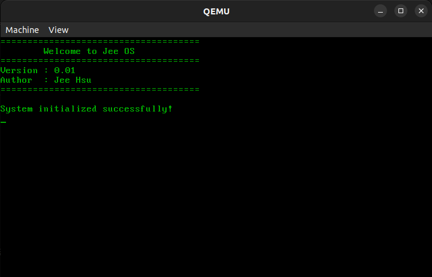

# Jeeos-0.01 学习文档

## 📚 文档目录

| 文档 | 说明 |
|------|------|
| [01-计算机基础.md](01-计算机基础.md) | 计算机软硬件基础知识 |
| [02-编译基础.md](02-编译基础.md) | 编译原理与构建系统 |
| [03-环境搭建.md](03-环境搭建.md) | 开发环境安装配置 |
| [04-源码架构.md](04-源码架构.md) | 项目结构与架构设计 |
| [05-内存布局.md](05-内存布局.md) | 系统镜像与内存布局 |
| [06-源码讲解.md](06-源码讲解.md) | 核心源码详细分析 |

## 🎯 学习路径

```
┌─────────────────────────────────────────────────────────────┐
│                    Jeeos 学习路径                            │
├─────────────────────────────────────────────────────────────┤
│                                                             │
│  第一阶段：基础知识                                          │
│  ┌─────────────┐    ┌─────────────┐    ┌─────────────┐     │
│  │ 计算机基础   │ -> │ 编译基础    │ -> │ 环境搭建    │     │
│  └─────────────┘    └─────────────┘    └─────────────┘     │
│                                                             │
│  第二阶段：深入理解                                          │
│  ┌─────────────┐    ┌─────────────┐    ┌─────────────┐     │
│  │ 源码架构    │ -> │ 内存布局    │ -> │ 源码讲解    │     │
│  └─────────────┘    └─────────────┘    └─────────────┘     │
│                                                             │
│  第三阶段：动手实践                                          │
│  ┌─────────────────────────────────────────────────────┐   │
│  │  编译运行 -> 修改代码 -> 添加新功能 -> 深入探索      │   │
│  └─────────────────────────────────────────────────────┘   │
│                                                             │
└─────────────────────────────────────────────────────────────┘
```

## 🚀 快速开始

```bash
# 1. 安装依赖
sudo apt update
sudo apt install -y nasm gcc gcc-multilib make binutils qemu-system-x86

# 2. 查看帮助
make help

# 3. 编译并运行
make qemurun
```

**运行效果：**



## 🛠️ 构建命令

| 命令 | 说明 |
|------|------|
| `make help` | 显示帮助信息 |
| `make build` | 编译内核 |
| `make install` | 编译并生成二进制内核 |
| `make clean` | 清理编译文件 |
| `make qemurun` | 使用 QEMU 运行 |
| `make qemudebug` | QEMU + GDB 调试模式 |
| `make vboxrun` | 使用 VirtualBox 运行 |
| `make gdb` | 显示 GDB 连接命令 |
| `make gdbrun` | 启动 GDB 调试脚本 |

## 🔧 调试方法

```bash
# 终端1: 启动调试模式
make qemudebug

# 终端2: 连接GDB
make gdbrun
# 或手动连接:
# gdb build/JeeOS.elf
# (gdb) target remote :1234
# (gdb) break main
# (gdb) continue
```

## 📖 关于 Jeeos

Jeeos 是一个用于学习操作系统原理的微型内核项目。版本 0.01 实现了：

- ✅ Multiboot 引导协议（兼容 GRUB1/GRUB2）
- ✅ 32位保护模式切换
- ✅ VGA 文本模式显示
- ✅ 基础的字符输出功能

## 📁 项目结构

```
Jeeos-0.01/
├── boot/           # 引导代码
│   └── startup.asm
├── kernel/         # 内核代码
│   └── main.c
├── lib/            # 库函数
│   ├── console.c
│   └── console.h
├── tools/          # 工具脚本
│   └── gdb_debug.sh
├── docs/           # 文档
├── build/          # 编译输出
├── Makefile        # 构建脚本
└── kernel.lds      # 链接脚本
```

## 👤 作者

- **Author**: Jee Hsu
- **Version**: 0.01

