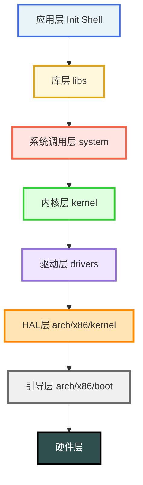

# Jeeos 操作系统

> 从零开始，亲手构建一个操作系统

---

## 快速开始指南

> 10分钟带你上手 Jeeos

### 步骤1：检查环境（1分钟）

```bash
# 开发系统环境 Ubuntu 22.04
# 下载源码
git clone https://github.com/hsujee/jeeos.git

# 检查必要工具是否已安装
which nasm gcc make qemu-system-i386

# 如果缺少工具，快速安装
sudo apt update
sudo apt install -y nasm gcc gcc-multilib make qemu-system-x86
```

### 步骤2：编译内核（2分钟）

```bash
# 进入项目目录
cd /home/jee/projects/jeeos/Jeeos-0.12

# 清理并编译
make clean
make build

# 等待编译完成，你会看到：
# [BUILD] Kernel image created: build/jeeos.eki
```

**编译时间**：约30秒-1分钟（取决于机器性能）

### 步骤3：运行系统（2分钟）

```bash
# 启动QEMU虚拟机
make qemurun

# 你将看到：
# ========================================
#   Jeeos-0.12 Starting...
# ========================================
# [ARCH] Platform initializing...
# ...
# Press any key to enter shell...
```

**按任意键进入Shell！**

```
jeeos> help
Available commands:
  help     - Show this help message
  clear    - Clear screen
  time     - Show current time
  uptime   - Show system uptime
  mem      - Show memory information
  ps       - Show process list
  echo     - Echo arguments
  version  - Show version
  reboot   - Reboot system

jeeos> version

Jeeos 0.12 (Jee Hsu)
A simple educational operating system
Copyright (c) 2025 Jee Hsu

jeeos> ps

Process List:
PID  STATE    NAME
---  -------  --------
0    RUN      idle
1    SLEEP    init
2    RUN      shell

jeeos> mem

Memory Information:
  Total Memory: 128 MB
  Free Pages:   30245
  Used Pages:   2523
```

### 退出QEMU

按 `Ctrl+A` 然后按 `X`，或使用 `reboot` 命令。

---

## Makefile 命令参考

### 编译与清理

```bash
make build       # 清理并完整编译内核
                 # = make clean + make all

make install     # 编译并安装到 build/release/ 目录
                 # 包括：内核、资源文件、工具

make clean       # 清理所有编译生成的文件
```

**说明**：

- `build` 是最常用的命令，确保完全重新编译
- `install` 会自动调用 `build`，然后打包所有文件
- `clean` 会删除所有 .o、.bin、.elf 等中间文件

### 运行目标

```bash
make qemurun     # 使用 QEMU 运行系统
                 # = make install + 创建虚拟硬盘 + 打包镜像 + 启动QEMU
                 # 串口自动输出到终端

make qemudebug   # QEMU 调试模式
                 # 启动后暂停，等待 GDB 连接到端口 1234

make vboxrun     # 使用 VirtualBox 运行系统
```

**说明**：

- `qemurun` 是最常用的测试命令，一键完成所有步骤
- `qemudebug` 用于源码级调试，需配合 GDB 使用
- 串口日志默认输出到启动 QEMU 的终端

### GDB 调试

```bash
make gdb         # 显示 GDB 连接命令参考
                 # 输出：如何手动连接 GDB 的步骤

make gdbrun      # 启动 GDB 调试脚本
                 # 自动连接到 localhost:1234
                 # 自动加载 build/jeeos.elf 符号文件
```

**典型调试流程**：

```bash
# 终端1：启动 QEMU 调试模式
make qemudebug

# 终端2：连接 GDB
make gdbrun

# 在 GDB 中：
(gdb) break start_kernel
(gdb) continue
(gdb) next
(gdb) print variable
```

**忘记 GDB 命令？**

```bash
make gdb
# 输出：
# ========================================
#   GDB 调试命令参考
# ========================================
#   gdb
#   (gdb) target remote :1234
#   (gdb) file build/jeeos.elf
#   (gdb) break start_kernel
#   (gdb) continue
# ========================================
```

### 开发工具

```bash
make cscope      # 生成 cscope 索引文件
                 # 用于代码搜索和浏览

make tags        # 生成 ctags 索引文件
                 # 用于代码跳转（Ctrl+]）

make cg          # 生成函数调用图
make callgraph   # （同上）
                 # 输出：linux-0.11.jpg
```

**cscope 使用（在 vim 中）**：

```vim
:cs find s symbol    " 查找符号
:cs find g symbol    " 查找定义
:cs find c symbol    " 查找调用这个函数的函数
:cs find d symbol    " 查找这个函数调用的函数
```

**ctags 使用（在 vim 中）**：

```vim
Ctrl+]              " 跳转到定义
Ctrl+T              " 返回
:tag function_name  " 跳转到指定函数
```

### 帮助

```bash
make help        # 显示所有可用命令及说明
```

### 常用场景

**场景1：首次开发**

```bash
# 1. 生成代码索引（方便导航）
make cscope
make tags

# 2. 编译
make build

# 3. 运行测试
make qemurun
```

**场景2：修改代码后测试**

```bash
# 快速迭代
make build && make qemurun
```

**场景3：调试问题**

```bash
# 方式1：查看串口日志
make qemurun
# 观察终端的串口输出

# 方式2：GDB 调试
make qemudebug   # 终端1
make gdbrun      # 终端2
```

**场景4：查看函数调用关系**

```bash
# 生成调用图
make cg

# 查看生成的 linux-0.11.jpg
xdg-open linux-0.11.jpg  # Linux
open linux-0.11.jpg      # macOS
```

**场景5：完全重新编译**

```bash
# build 已经包含了 clean
make build

# 如果想手动清理
make clean
make build
```

### 常见问题

**Q: `make build` 失败**

```bash
# 检查编译工具
which gcc nasm ld make

# 查看错误信息
make build 2>&1 | tee build.log
```

**Q: `make qemurun` 无法启动**

```bash
# 确认 QEMU 已安装
which qemu-system-i386

# 检查镜像文件
ls -lh build/release/jeeos.eki
```

**Q: GDB 无法连接**

```bash
# 1. 确认 qemudebug 正在运行
ps aux | grep qemu

# 2. 检查端口
netstat -an | grep 1234

# 3. 查看帮助
make gdb

# 4. 手动连接
gdb build/jeeos.elf
(gdb) target remote :1234
```

**Q: 编译时提示 `gcc: error: unrecognized command line option '-m32'`**

```bash
sudo apt install gcc-multilib
```

**Q: 按键后没有进入Shell**

```bash
# 检查串口日志
make qemurun
# 查找是否有 "KEYBOARD" 驱动加载成功的日志
```

---

## 学习路线图


---

## Jeeos 系统架构



**分层架构详解**（从上到下）：

| 层级           | 目录/文件          | 核心组件                                          | 功能说明                 |
| -------------- | ------------------ | ------------------------------------------------- | ------------------------ |
| **应用层**     | `kernel/`          | Init(PID=1), Shell(PID=2)                         | 内核态线程，提供用户交互 |
| **库层**       | `libs/`            | libmem, libio, printf, string                     | 通用库函数，类似 libc    |
| **系统调用层** | `system/`          | syshandler, sysopen, sysfork                      | 系统调用接口实现         |
| **内核层**     | `kernel/`          | mm(内存), thread(进程), sched(调度), device(设备) | 核心功能模块             |
| **驱动层**     | `drivers/`         | timer, serial, keyboard, rtc, speaker, ramfs      | 8个设备驱动程序          |
| **HAL层**      | `arch/x86/kernel/` | idt(中断), mmu, cpu_ops, platform                 | 硬件抽象层               |
| **引导层**     | `arch/x86/boot/`   | bootsect.asm, setup.asm, bootparam.asm            | 系统启动引导             |
| **硬件层**     | -                  | CPU, 内存, 外设                                   | 物理硬件                 |

> **重要**：Jeeos-0.12 的 Init 和 Shell 是**内核态线程(Ring0)**，不是用户空间程序(Ring3)。

---

## 源码目录对照

| 文档章节 | 对应源码目录       |
| -------- | ------------------ |
| 引导程序 | `arch/x86/boot/`   |
| HAL 层   | `arch/x86/kernel/` |
| 内核核心 | `kernel/`          |
| 设备驱动 | `drivers/`         |
| 系统调用 | `system/`          |
| 用户库   | `libs/`            |

---

## 🔗 相关版本

| 版本       | 说明                               |
| ---------- | ---------------------------------- |
| Jeeos-0.01 | 入门级内核，仅 VGA 输出            |
| Jeeos-0.11 | 中级框架，完整 HAL + 内存管理      |
| Jeeos-0.12 | 完整版，包含驱动、Shell 和用户空间 |

## 文档说明

- 所有文档使用 Markdown 格式
- 架构图使用 Mermaid 语法
- 代码示例基于 Jeeos-0.12 源码
- 欢迎提出改进建议

**参考资料**：

- 《操作系统设计与实现》—— Tanenbaum
- 《深入理解计算机系统》
- 《Linux 内核设计与实现》
- Intel 软件开发手册

---

**祝学习愉快！**